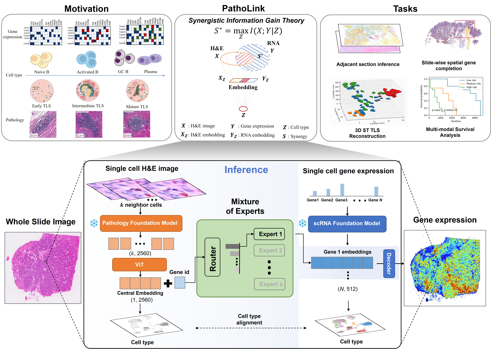

# PathoLink

**PathoLink** is a multimodal learning framework designed to bridge **histopathological images** and **spatial/single-cell omics data**.  
It leverages **Transformer architectures** and a **Mixture-of-Experts (MoE)** mechanism to enable scalable, interpretable **cross-modal prediction** and **morphology–molecular alignment**.

> 🧬 This repository is the official implementation accompanying our paper *“PathoLink: Bridging Pathology and Transcriptomics at Single-Cell Resolution by Synergistic Information Gain Theory”*, which is **currently under review**.  
> The code is under **active development**, and we will continue updating this repository with new modules and pretrained checkpoints — **stay tuned!**

---

## 🌟 Overview

In conventional models, predicting molecular expression (`Y`) from histology (`X`) is constrained by modality-specific redundancy.  
**PathoLink** introduces a synergistic information framework that learns a shared latent representation `Z` bridging both domains — reducing conditional uncertainty and enhancing predictive power:

H(Y|X,Z) < H(Y|X)

This design enables interpretable feature learning and robust cross-modal generation between tissue morphology and omics signals.

---

## 🧩 Repository Structure

```
PathoLink/
├── Virchow2/                    # Vision backbone (Virchow2 patch-level encoder)
├── scGPT/                       # scGPT integration for single-cell/omics representation
├── fmoe/                        # Mixture-of-Experts (FastMoE) implementation
├── dataset/HEST/                # HEST data loading and preprocessing
├── build/                       # Compiled extensions
├── cuda/                        # CUDA kernels for GPU acceleration
├── doc/                         # Documentation
├── tests/                       # Unit tests
├── MoE.py                       # Mixture of Experts layer
├── transformer.py               # Transformer architecture
├── train_patholink.py           # Multi-task training script (MMD + MSE + classification)
├── infer_virchow2.py            # Virchow2 inference for cell patches
├── infer_scgpt.py               # scGPT inference for gene embeddings
├── prepare_patholink_npz.py     # Data preparation pipeline
├── visualize_results.py         # Visualization tools (spatial, UMAP, PCC, SSIM)
└── requirements.txt             # Dependencies
```

---

## ⚙️ Installation

```bash
git clone https://github.com/whytin/PathoLink.git
cd PathoLink

# (Recommended) Create a conda environment
conda create -n patholink python=3.9
conda activate patholink

# Install dependencies
pip install -r requirements.txt
```

---


---

## 🚀 Quick Start

### Step 1: Prepare Data

PathoLink requires precomputed embeddings from Virchow2 and scGPT. Starting from HEST data:

```bash
# 1. Extract Virchow2 image embeddings from cell patches
python infer_virchow2.py \
  --h5ad path/to/hest_data.h5ad \
  --output embeddings/img_emb.npy \
  --batch_size 256

# 2. Extract scGPT gene-level embeddings and cell type labels
python infer_scgpt.py \
  --h5ad path/to/hest_data.h5ad \
  --model_dir path/to/scGPT_pretrained \
  --output_gene_emb embeddings/gene_emb.npy \
  --output_cell_type embeddings/cell_type.npy \
  --batch_size 64

# 3. Prepare training data
python prepare_patholink_npz.py \
  --h5ad path/to/hest_data.h5ad \
  --img_emb embeddings/img_emb.npy \
  --gene_emb embeddings/gene_emb.npy \
  --cell_type embeddings/cell_type.npy \
  --output data/patholink_train.npz
```

### Step 2: Train PathoLink

```bash
python train_patholink.py \
  --train_npz data/patholink_train.npz \
  --batch_size 64 \
  --epochs 50 \
  --lr 1e-4 \
  --lambda_mmd 1.0 \
  --lambda_expr 1.0 \
  --lambda_cls 1.0 \
  --output_dir outputs/patholink_run1
```

**Key Parameters:**
- `--lambda_mmd`: Weight for MMD alignment loss (image-gene embedding alignment)
- `--lambda_expr`: Weight for MSE expression reconstruction loss
- `--lambda_cls`: Weight for cell type classification loss
- `--num_experts`: Number of MoE experts (default: 4)
- `--mmd_max_samples`: Maximum samples for MMD computation (default: 8192)

### Step 3: Visualize Results

```bash
# Evaluate predictions and generate visualizations
python visualize_results.py \
  --h5ad path/to/hest_data.h5ad \
  --expr_true path/to/expr_true.npy \
  --expr_pred path/to/expr_pred.npy \
  --spatial_genes CD3D CD8A EPCAM \
  --compute_ssim \
  --compute_pcc \
  --gene_corr_heatmap \
  --scatter_plot \
  --output_dir visualizations/
```

**Available Visualizations:**
- Spatial gene expression maps
- UMAP dimensionality reduction
- Clustering results (Leiden)
- SSIM (Structural Similarity Index)
- PCC (Pearson Correlation Coefficient)
- Gene correlation heatmaps
- True vs predicted scatter plots

---

## 🧠 Model Architecture

<div align="center">
  
</div>

PathoLink integrates three main components:

1. **Virchow2** — Vision encoder for histopathological patches.  
2. **scGPT** — Pretrained omics encoder for molecular representation.  
3. **MoE-Transformer Fusion** — Multi-stage Transformer enhanced with **Mixture-of-Experts** routing for scalable cross-modal fusion and prediction.

The framework follows a synergistic information flow:
```
(H&E Image (X) → synergy variable (Z) )→ Omics Prediction (Y)
```

---

## 🧪 Development Status

- [x] Core model implementation (MoE + Transformer)
- [x] scGPT integration
- [x] Virchow2 integration
- [x] Full training pipeline (multi-task: MMD + MSE + classification)
- [x] Inference scripts (Virchow2 + scGPT)
- [x] Data preparation pipeline
- [x] Visualization tools (spatial, UMAP, PCC, SSIM)
- [ ] Pretrained checkpoints
- [ ] Comprehensive documentation

> 🔧 *The codebase is being actively updated. Please watch or star the repository to get the latest updates.*

---

> 📢 *PathoLink is under active development — follow the repository for upcoming updates, pretrained models, and experiment results!*
